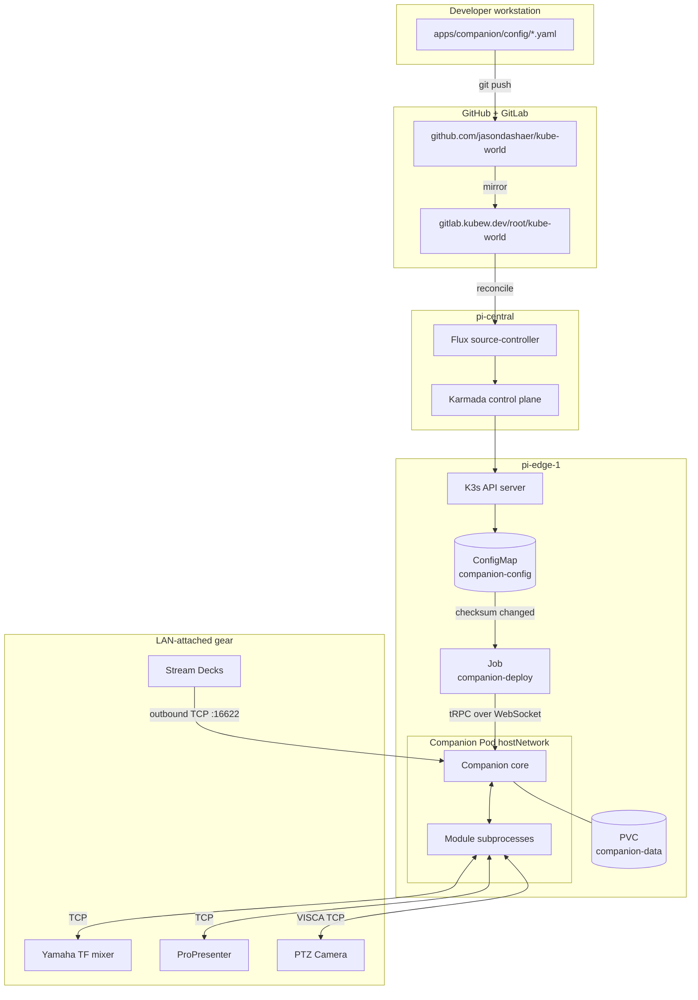

# Companion Architecture

Canonical reference for the Bitfocus Companion subsystem of `kube-world`. See also: [PIPELINE.md](PIPELINE.md), [INVENTORY.md](INVENTORY.md), [STATUS.md](STATUS.md).

## 1. Where Companion Sits in kube-world

Companion is an **edge-only IoT workload**. It runs on `pi-edge-1` (a single-node K3s cluster) and never on the central node. It is propagated to the edge by Karmada via the `iot-apps.yaml` PropagationPolicy and reconciled by Flux from the GitLab mirror at `gitlab.kubew.dev/root/kube-world`.

```
GitLab (source of truth)
   |
   v
Flux on pi-central -- reconciles GitRepository
   |
   v
Karmada control plane -- applies PropagationPolicy
   |
   v
pi-edge-1 (K3s)
   |
   +-- Namespace: companion
   |     |
   |     +-- Deployment: companion (replicas=1, hostNetwork=true)
   |     +-- PVC: companion-data (1Gi, local-path)
   |     +-- Service: companion (ClusterIP :8000, :16622)
   |     +-- ConfigMap: companion-config (YAML sources)
   |     +-- ConfigMap: companion-seed-db (initial sqlite DB)
   |     +-- Job: companion-deploy (importer, triggered by checksum)
   |
   +-- LAN (hostNetwork) -- talks to mixers, ProPresenter, PTZ, Stream Decks
```

## 2. Pi -> K3s -> hostNetwork -> Companion

The single most consequential architectural choice in this subsystem is `hostNetwork: true` on the Companion deployment.

| Layer | Behavior |
|-------|----------|
| **Pi-edge-1** | Single SBC running K3s (server+agent on one node). DHCP'd onto whatever LAN it sits on. |
| **K3s pod network** | Flannel VXLAN. Useless for talking to LAN-attached AV gear because mDNS/multicast and arbitrary outbound TCP from pods would have to NAT through the node. |
| **`hostNetwork: true`** | The Companion pod's network namespace **is** the host's. `0.0.0.0:8000` on the pod = `<pi-LAN-IP>:8000` on the LAN. No CNI translation. |
| **`dnsPolicy: ClusterFirstWithHostNet`** | Pod still resolves `*.svc.cluster.local` via CoreDNS (used for the Home Assistant connection at `home-assistant.home-assistant.svc.cluster.local:8123`). |
| **mDNS / Elgato discovery** | Stream Decks send Elgato Stream Deck Network protocol traffic over outbound TCP from the deck to Companion's port 16622. With hostNetwork this works without IGMP-snooping or multicast hacks. |

### Consequence: the Pi's LAN IP matters

When the Pi changes networks (e.g. moves from YIBC LAN to Saitama LAN), every Stream Deck has to be reconfigured to point at the new IP. K3s's embedded etcd can also wedge against the old IP — symptom is Companion's UI returning HTTP 404 forever. Fix: `systemctl restart k3s` or power cycle.

## 3. Module Process Model

Companion 4.x runs each module as a **separate Node.js subprocess**, communicating with the Companion core over an internal IPC channel. This matters because:

| Property | Implication |
|----------|-------------|
| **Module crash isolation** | A module crash (e.g. `yamaha-rcp` `findRcpCmd undefined`) takes out only that module, not the whole Companion. The UI shows the connection as "crashed". |
| **Per-module memory** | Each module is ~30-80MB resident. With ~6 connections we run ~250MB just for module subprocesses, which is why deployment requests `384Mi` and limits at `1Gi`. |
| **Upgrade scripts run at module start** | `yamaha-rcp` runs `upg2xxto30x` on connection init. If `isFirstInit` is missing, it tries to upgrade nonexistent action data and crashes. The deployer always sets `isFirstInit: true`. |
| **Module versions are pinned per-connection** | `moduleVersionId` on each instance. We let it be `null` to use the latest installed version. |

```
companion (PID 1, Node)
  |
  +-- module subprocess: ptzoptics-visca   (TCP -> 192.168.1.113:5678)
  +-- module subprocess: yamaha-rcp [yibc] (TCP -> 192.168.1.54:49280)
  +-- module subprocess: yamaha-rcp [sait] (TCP -> 192.168.10.30:49280)
  +-- module subprocess: renewedvision-propresenter [yibc]
  +-- module subprocess: renewedvision-propresenter [saitama]
  +-- module subprocess: homeassistant-server (HTTP via cluster DNS)
  +-- module subprocess: internal (built-in)
```

## 4. Connection Model: Parallel Per-Location Pattern

We deliberately define **both** locations' connections simultaneously in `connections.yaml`, even though only one location's gear is reachable at a time.

| Connection ID | Module | Target | Used By |
|---------------|--------|--------|---------|
| `homeassistant` | `homeassistant-server` | cluster-internal | shared (HA always reachable) |
| `ptz` | `ptzoptics-visca` | `192.168.1.113:5678` | YIBC pages only |
| `yamaha_yibc` | `yamaha-rcp` | `192.168.1.54` (TF5) | YIBC pages |
| `propresenter_yibc` | `renewedvision-propresenter` | `192.168.1.2:1025` pass=`YIBC` | YIBC pages |
| `yamaha_saitama` | `yamaha-rcp` | `192.168.10.30` (TF1) | Saitama pages |
| `propresenter_saitama` | `renewedvision-propresenter` | `192.168.68.55:53678` pass=`test1234` | Saitama pages |

### Why parallel, not switched?

| Approach | Verdict |
|----------|---------|
| Single set of connections, swap host on relocate | Rejected. Requires editing config (or runtime rebind) at every move; defeats GitOps. |
| Two parallel sets, one location's gear unreachable | **Chosen.** Disconnected connections show red status indicators which is acceptable. Pages reference connections by ID, so YIBC pages keep working when at YIBC, Saitama pages keep working when at Saitama. |
| Two Companion deployments | Rejected. Single source of truth, single Pi, single PVC. Not worth the complexity. |

Tradeoff: at any time roughly half of the connection statuses on the dashboard are red. This is by design — they correspond to the location not currently active.

## 5. Stream Deck Network Module Connection Model

Stream Decks attach via **Elgato Stream Deck Network** protocol. Critically, this is **outbound TCP from the deck to Companion**, not the other way around.

```
Stream Deck XL (192.168.1.41)
   |
   |  outbound TCP to <companion-host>:16622
   v
Companion (pi-edge-1 LAN IP, port 16622)
```

| Property | Detail |
|----------|--------|
| **Direction** | Deck -> Companion (deck initiates). |
| **Port** | TCP 16622 (the `satellite` port in deployment.yaml). |
| **Configuration on deck** | Each deck's setup screen has an IP field. We set this to the Pi's LAN IP. When the Pi moves networks, all decks need to be re-pointed. |
| **Why not USB?** | The Pi is in a rack/cabinet. Decks are physically distributed (FOH, stage, balcony). Network is the only practical transport. |
| **Surface group ID** | `streamdeck:<serial>` — stable across imports, used by `surfaces.yaml` to reassign startup pages after every config import. |

Three decks at YIBC, one at Saitama. See [INVENTORY.md](INVENTORY.md) for serials.

## 6. Storage Model

| Volume | Path in Pod | Backing | Purpose |
|--------|-------------|---------|---------|
| `data` | `/companion` | PVC `companion-data` (1Gi `local-path`) | Live Companion state — sqlite DB, module store, cache. Survives pod restart. |
| `seed-db` | `/seed` (init container only) | ConfigMap `companion-seed-db` | One-shot seed of `db.sqlite` on a brand-new PVC. Init container copies it to `/companion/v4.2/db.sqlite` if absent. |

The `COMPANION_CONFIG_DIRECTORY` env var is set to `/companion` (not `/companion/data`) — this was a previous fix; the canonical layout under `$COMPANION_CONFIG_DIRECTORY` is `v4.2/db.sqlite`, `v4.2/cloud`, etc.

## 7. Why This Architecture (Decisions and Tradeoffs)

| Decision | Rationale | Tradeoff |
|----------|-----------|----------|
| **GitOps for Companion config** | Single source of truth, audit log, rollback via `git revert`, no UI drift. | Round-trip latency: edit YAML -> push -> Flux reconcile -> Job -> import -> ~60-120s. UI changes are forbidden. |
| **YAML -> .companionconfig pipeline** | Companion has no native declarative API. tRPC import endpoint exists for the .companionconfig blob format; we generate the blob server-side. | Generator (`companion-deploy.py`) has to mirror Companion's internal schema. Schema drift between Companion versions = deployer breakage. |
| **Single Companion, two locations** | One PVC, one deployment, one URL to remember. | Half of connections always disconnected. Operators must understand which pages map to which location. |
| **`hostNetwork: true`** | mDNS, low-latency LAN access, simple routing to AV gear. | Pod's network is the host's — no NetworkPolicy isolation. Pi LAN IP changes break everything (Stream Deck repointing required). |
| **Companion runs on edge, not central** | Central Pi has GitLab + Karmada + Rancher + Zitadel; can't risk priority-load contention with realtime AV control. | If pi-edge-1 fails, no Companion at all. No HA/failover (yet). |
| **Init container for DB seed** | Cleanly handles fresh PVC vs existing PVC without losing local module installs/cache. | The seed sqlite has to be kept in sync with Companion version bumps. Treated as a bootstrap convenience, not a recovery mechanism. |
| **`Recreate` strategy** | Companion holds the sqlite open exclusively; rolling update would deadlock on PVC RWO. | Brief downtime (~30s) during deploys. Acceptable — config imports happen offline anyway. |

## 8. End-to-End Diagram



## 9. Cross-References

- Pipeline detail (every step from `git push` to button update): [PIPELINE.md](PIPELINE.md)
- Hardware inventory and channel maps: [INVENTORY.md](INVENTORY.md)
- Current operational state: [STATUS.md](STATUS.md)
- Document changelog: [CHANGELOG.md](CHANGELOG.md)
- Agent context (conventions, gotchas): `apps/companion/CLAUDE.md`
